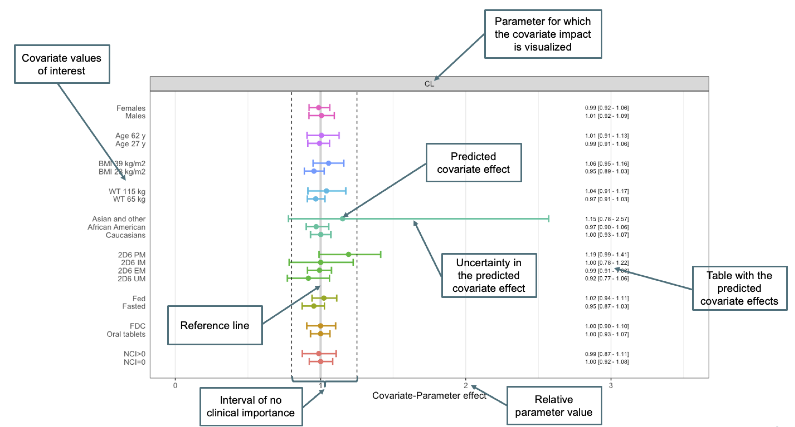

```{r, include = FALSE}
knitr::opts_chunk$set(
  collapse = TRUE,
  comment = "#>"
)
```

<!-- output: rmarkdown::html_vignette -->

```{r setup,}
suppressPackageStartupMessages(library(PMXForest))
library(tools)

theme_set(theme_bw(base_size=18))
theme_update(plot.title = element_text(hjust = 0.5))

set.seed(865765)
```

# Introduction

Forest plots is an effective way of communicating the impact of covariates. The principal is that the predicted effect of a particular value of the covariate on a primary or secondary parameter is visualized together with a measure of the uncertainty around the predicted parameter value. By calculating and visualizing the impact of different covariates and covariate values, inference can be made about the relative importance of the covariates. An example Forest plot, with important features highlighted, is provided in Figure \@ref(fig:exampleForest).

Forest plots have been used in the context of *full covariate models*, i.e. models that implement a set of pre-specified covariates without requiring that the covariates meet a certain level of statistical significance. The impact of all the pre-specified covariates are then visualized using Forest plots. The pre-specification of the covariates supports inference without the risk of selection bias.

In contrast, models developed using data driven methods, such as the scm, which are more exploratory and for which the predictors in the final model are nor known beforehand, have traditionally not used Forest plots as a results communication tool. This is partly because the potentially flawed inference caused by selection bias and partly because the parameter-covariate combinations not included in the final models will be predicted to have no impact on the parameters (and are therefore judged to have no justified place in the plot). Forest plots constructed based on scm type models will therefore only have one or a few covariates with any type of signal included in the plots.

## Standardized covariate model visualization at Pharmetheus

At Pharmetheus there are two main covariate model building techniques; scmplus, which is an efficient variant of the legacy scm method, and Full Random Effects Models (FREM), which is a Full Model method with better properties than the Full Model Method (described elsewhere).

Despite having two different covariate model building methodologies in the standard Pharmetheus toolbox, it would be beneficial to be able to communicate the results of the covariate analysis in the same principal way. In particular, a standard way of covariate model communication will make it easier to develop and maintain useful and efficient tools to support this strategy.

However, it is somewhat challenging to communicate/visualize the results from these two approaches in the same way. A FREM analysis provides results for all covariates included in the analysis (since it is a full model method no covariate is excluded from the model), while the scmplus only provide quantitative results for the covariates that are significant. (It can be argued that the non-significance of the non-significant covariates is a result but then it is more of a qualitative nature.)

Irrespective of these differences, it is the suggestion that Forest plots is the basic communication and visualization tool for covariate models at Pharmetheus. For FREM models it is a very natural method and for scmplus models Forest plots can be made to work, either by visualizing the lack of effect (0 +/- uncertainty) for the non-significant covariate effects or the impact of the significant covariates (!=0 +/- uncertainty). The main difference in Forest plots based on FREM and scmplus analyses is that the latter only provides quantitative information about *presence of impact* and not *lack of impact* while former will provide quantitative information about both lack *and* presence of impact. 

The above difference between FREM and scmplus based models is true if the Forest plots are based on direct predictions from the underlying model. An alternative approach, which will be referred to as *empirical Forest plots* can be used to visualize the impact of all covariates *for the current set of data* even if the model only includes a subset of the available covariates. Empirical Forest plots are similar to Forest plots based on FREM (and to some extent Full Covariate Models) but instead of using direct model predictions it relies on the correlations between the covariates. For simplicity, Forest plots that rely on direct predictions from the model will be referred to as *parametric Forest plots.* Further details on empirical Forest plots and how they can be constructed is provided in Section \@ref(sec:empForest).


## The elements of a Forest plot

Figure \@ref(fig:exampleForest) shows a (parametric) Forest plot with important features highlighted:

* Parameter  
A Forest plot displays the impact of covariate on a primary of secondary *parameter*, in this case CL.
* Covariate value  
The plot visualizes the predicted impact on the parameter by setting the covariate to a particular value. In the example in Figure \@ref(fig:exampleForest) only one covariate value at a time is altered to obtain the predicted impact but it is perfectly possible to use combinations of covariate values for the prediction, e.g. young and old females.
* Predicted covariate effect  
The predicted impact of covariate values.
* Uncertainty in the predicted covariate effect  
The uncertainty in the prediction is visualized using a horizontal bar. The PMXForest package supports four different ways to compute the uncertainty (see Section \@ref(sec:uncertainty)).
* Table with predicted covariate effects  
Numerical specifications of the predicted covariate effects and uncertainties are often included the Forest plots.
* Reference line  
The reference parameter value can be indicated by a vertical line. The reference value can be specified by the user or be computed based on the model. This is further discussed in Section \@ref(sec:referenceValues).
* Interval of no importance  
A region of no clinical importance is often included in Forest plots. This is to provide something to relate the uncertainties to and will facilitate the inference.
* Relative parameter value  
The x-axis scale can be on a relative scale (relative to the reference parameter value) or on the absolute parameter scale. If the covariate impact on more that one parameter is show (in separate Forest plots) it is usually more informative to use a relative scale.

```{r exampleForest, echo=F, fig.cap="Annotated Forest plot"}

```

## Organisation of this document

In the following the document is organised in two parts. The first concerns parametric Forest plots and the second empirical Forest plots. The two approaches have a great deal in common and share many `PMXForest` functions. The first part, about the parametric Forest plots, will therefore provide most of the details about the implementation while the second part will only highlight the required differences to the fir part.

# Parametric Forest plots

## Computing the predicted covariate effect

The parameter to be visualized in the Forest plot may be "primary" or "secondary". Primary parameters are those that are directly estimated in the NONMEM model, e.g. CL and secondary parameters are those that are derived from the primary parameters, e.g. AUC or Cmax. This requires that the covariate models for the involved primary parameter values (Section \@ref(sec:paramFunction)) and the functions for the secondary parameters are implemented as R functions. 

With the functions i place it is quite straight forward to compute the  predicted parameter values. It is just to communicate the covariate values of interest to the functions (see Section \@ref(sec:dfCovs)).


## Obtaining the uncertainty for the Forest plots {#sec:uncertainty}

One of the challenges with Forest plots is to obtain the uncertainty in the predicted parameter value.

The basic way to assess the uncertainty in primary parameter estimates from NONMEM is the output from the \$COV step. These standard errors a parametric and can be used to derive a confidence interval under normal distribution assumptions. In particular, these confidence intervals will be symmetrical. The main benefit of this approach is the convenience. In most cases there will be \$COV information available without needing any extra efforts. The drawbacks are related to the assumptions mentioned above and that it becomes more involved if the interest is in secondary parameters, i.e. parameters that are functions of the primary parameters, for example Cmax and AUC.

The uncertainties can also be obtained non-parametrically. The bootstrap is an example of such a method, sampling importance resampling (SIR) is another. The main benefit with these approaches is the lack of symmetry assumptions - the derived confidence intervals will be asymmetrical if so indicated by the data. The drawback is that these methods can take quite some time to run and that they require an extra effort after the covariate model has been established.

The `PMXForest` package has generalized the uncertainty assessment so that the the same procedure can be used regardless of the underlying method to obtain the uncertainty in the primary parameters, if it is a parametric or empirical Forest plot or if the covariate analysis strategy is FREM or scm(plus).

The uncertainties in the predicted parameter values are calculated in two steps:

1. Derive a multivariate distribution of primary parameter estimates.
2. Compute the corresponding distribution of the (primary or secondary) secondary parameter value of interest.
3. From the distribution in 2, determine the desired confidence interval numerically from the corresponding percentiles.

Steps 2 and 3 are independent of how the multivariate distribution in step 1 was derived. 

The `PMXForest` package directly supports four ways to derive the step 1 distribution:

1. The output of the \$COV step from NONMEM.  
With this approach the distribution of the primary parameters will be obtained by multivariate sampling from the \$COV variance-covariance matrix. The computed uncertainty will be symmetric and will rely on normal distribution assumptions.
2. Parametric uncertainty estimates from a (small) bootstrap (e.g. n=30-50).  
In this method, a parametric variance-covariance matrix is computed from a limited set of bootstrap samples and the distribution of the primary parameters is obtained by multivariate sampling from this matrix. The computed uncertainty will be symmetric and will rely on normal distribution assumptions. You would use this method in case the \$COV from NONMEM is unsuccessful (or for some reason is unreliable) and the runtimes makes a full bootstrap or a SIR unpractical.
3. Non-parametric uncertainty estimates from a large bootstrap (n=250).  
A full bootstrap will result in uncertainties that does not rely on normality assumptions and whose confidence intervals can be non-symmetrical. The multivariate distribution is taken as the bootstrap estimates and it is therefore important to have a sufficiently large n. The main drawback of this approach is obviously the run times but n=250 will result in a precision for the percentile limits of a 90% confidence interval that meet the Pharmetheus standards. 
4. Uncertainty estimates from a SIR analysis.  
The samples available from a SIR analysis is used as the multivariate distribution of the primary parameter estimates. This method would be used if a SIR is already available or if SIR is judged to be the preferred method of obtaining the uncertainties.


## Creating parametric Forest plots from scmplus models

Overall, there are three sets of required specifications needed:

1. The covariate values of interest needs to be specified (Section \@ref(sec:dfCovs)).
2. The model for the primary and/or secondary parameters need to be implemented in R functions (Section \@ref(sec:paramFunction)).
3. The multivariate distribution of the primary parameters needs to be derived (Section \@ref(sec:multivariateDist)).

With these specifications the data for the Forest plot can be setup (using the function `getForestDFSCM`, see Section \@ref(sec:setUpDataPar)) and the Forest plot created (see Section \@ref(sec:createForest)).


### Define the covariates to include in the Forest plot {#sec:dfCovs}

This specification has one required and two optional components.

The required specification is the list of covariate values to predict the parameter for. It is created using a helper function (`createInputForestData`)
```{r}
dfCovs <- createInputForestData(
  list( "FORM" = c(0,1),
        "FOOD" = c(0,1),
        "GENO" = c(1,2,3,4),
        "RACEL"= c(1,2,3),
        "WT"   = c(65,115),
        "AGE"  = c(27,62),
        "CRCL" = c(83,150),
        "SEX"  = c(1,2)),
  iMiss=-99) 
```

The data.frame `dfCovs` specifies the covariate values, or combination of values to visualize in the Forest plot. Each line if `dfCovs` correspond to one "row" in the Forest plot.
```{r, echo=F}
dfCovs
```

The structure of the `dfCovs` list determines how the covariate values are grouped on the y-axis. For example, the structure above would group `FORM` 0 an 1, `FOOD` 0 and , etc, and the groups will be slightly separated from each other in the plot. The grouping can also optionally be specified using the `cGrouping` argument to `getForestDFSCM`. For example:
```{r}
cGrouping <- 1:nrow(dfCovs)
cGrouping
```
would "de-group" all covariates and each covariate value would be plotted with the same distance to the other covariates. In contrast: 
```{r}
cGrouping <- c(1,1,2,2,3,3,3,3,4,4,4,5,5,6,6,7,7,8,8)
cGrouping
```
would result in the same grouping would result in the same grouping used by default for the above `dfCovs`.


The `cdfCovsNames` argument to `getForestDFSCM` is optional and specifies a name to be used for each row in `dfCovs`. If not provided, the original covariate names (e.g. `FORM`and `FOOD`) will be used on the y-axis in the Forest plot.
```{r}
covnames <- c("Oral tablets","FDC","Fasted","Fed","2D6 UM","2D6 EM","2D6 IM","2D6 PM","Caucasian",
              "African American","Asian and other","WT 65 kg","WT 115 kg",
              "Age 27 y","Age 62 y","CRCL 83 mL/min","CRCL 150 mL/min","Male","Female")
```

The `groupdist`and `withingroupdist´`arguments to the `getForestDFSCM` can be used to fine tune how the covariate names are displayed in the Forest plots.

The reference "subject", or set of covariates can be specified in the `dfRefRow` argument. It is not necessary to specify a value for all covariates but the user has to make sure that the parameter function handles the case when a covariate is not specified in the `df` argument (see Section \@ref(sec:paramFunction)).
```{r}
dfRefRow <- data.frame("FORM"=1,"FOOD"=1,RACEL=0,"GENO"=2,"WT"=75,"AGE"=70,"CRCL"=118,"SEX"=1)
```


### Define the model function {#sec:paramFunction}

The `functionList` argument to `getForestDFSCM` is a list of functions that computes the parameters to plot in the Forest plot from the NONMEM parameter estimates. More than one function can be provided but only the case with one function is covered in this document.

It is worth pointing out that this is a fragile part of the process of creating Forest plots with the `PMXForest` package. The user needs to specify the function to derive the parameter of interest, not seldom duplicating code already specified in NONMEM. Please be careful.

The most general approach is to (re-)define the NONMEM model for the typical individual parameters. The function below defines the models for CL, FREL and V, but only CL is returned in this case. 

This function will be called once for each row in `dfCovs` and each parameter set in the `dfSamples*` data frames (see below), and for `dfRefRow`, and it will use the available covariate columns and the values in those columns. This means that we need to handle the case when a covariate is not be present in `dfCovs` as well as the -99s. Note that there will be -99s in `dfCovs` even if there are no missing covariate values in the NONMEM data set. If the NONMEM code doesn't handle -99s, the code in the function here needs to be adjusted.

The parameter functions will have to accept a vector of fixed effects parameter estimates (`thetas`) and a one row data frame with covariate values. Other arguments provided by the user to `getForestDFSCM` will also be passed to the parameter functions.

Here is a general procedure for implementing the NONMEM code in the R function:

1. Copy the relevant parts of the NONMEM model file to the function.
2. Translate the NONMEM code to R:
    a. Replace NONMEM's `THETA()` with R's `theta[]`.
    b. Replace NONMEM's `EQ` (etc) with the corresponding R equivalent.
    c. Other modifications as needed, e.g `LOG` -> `log`
3. Make sure that the code handles missing covariate values (-99). * Note! This is needed even if the original NONMEM code didn't do this.*
4. Make sure that the code handles the case when the input data.frame (`df`) does not include columns for all covariates in the model. (See the `any(names(df))` below.)
  

```{r}

paramFunction <- function(thetas, df, ...) {

  FRELNCIL <- 1
  if (any(names(df) == "NCIL") && df$NCIL == 1) FRELNCIL <- 1 + thetas[16]

  FRELFORM <- 1 
  if (any(names(df) == "FORM") && df$FORM == 0) FRELFORM <- 1 + thetas[15]

  FRELCOV <- FRELFORM * FRELNCIL

  CLFOOD <- 1 
  if (df$FOOD == 0) CLFOOD <- 1 + thetas[14]
 
  CLCOV <- CLFOOD
 
  TVFREL <- thetas[1]
  if(any(names(df) == "GENO")) {
    if(df$GENO == 1) TVFREL <- TVFREL * (1 + thetas[11])
    if(df$GENO == 3) TVFREL <- TVFREL * (1 + thetas[12])
    if(df$GENO == 4) TVFREL <- TVFREL * (1 + thetas[13])
  }
  
  TVFREL <- FRELCOV * TVFREL

  if (!any(names(df) == "WT") || df$WT == -99) {
    TVCL <- thetas[4]
  } else {
    TVCL <- thetas[4] * (df$WT / 75)**thetas[2]
  }

  if(any(names(df) == "GENO")) {
    if (df$GENO == 1) TVCL <- TVCL * (1 + thetas[8])
    if (df$GENO == 3) TVCL <- TVCL * (1 + thetas[9])
    if (df$GENO == 4) TVCL <- TVCL * (1 + thetas[10])
  }
  
  TVCL <- CLCOV * TVCL

  if (!any(names(df) == "WT") || df$WT == -99) {
    TVV <- thetas[5]
  } else {
    TVV <- thetas[5] * (df$WT / 75)**thetas[3]
  }
  TVMAT <- thetas[6]
  TVD1  <- thetas[7]

  FREL <- TVFREL
  CL <- TVCL
  V <- TVV

  return(CL)
}


```
We also need to provide a name for the output from the function.

```{r}
functionListName <- c("CL")
```


### Obtain the multivariate distribution of the primary parameters {#sec:multivariateDist}

The `getForestDFSCM` package supports four methods for obtaining the uncertainties in the predicted parameter values (see Section \@ref(sec:uncertainty)). All of them require information from the .ext file.

```{r}
runno   <- 1
extFile <- system.file("extdata",paste0("run",runno,".ext"),package="PMXForest")
```


#### Use the output from the $COV step in NONMEM

This approach will sample parameter vectors from a variance-covariance matrix from NONMEM.

Read the cov file and get the multivariate parameter distribution.
```{r}
covFile <- system.file("extdata",paste0("run",runno,".cov"),package="PMXForest") 
dfSamplesCOV <- getSamples(covFile,extFile=extFile,n=200)
```


#### Use the output from a small bootstrap

This approach uses the bootstrap samples (from a small bootstrap) to create a (parametric) variance-covariance matrix from which parameter vectors are sampled and the confidence intervals computed.

```{r}
bootFilesmall    <- system.file("extdata","bs1_n30.dir",paste0("raw_results_run",runno,".csv"),package="PMXForest")
dfSamplesBSsmall <- getSamples(bootFilesmall,extFile=extFile)
```


#### Use the output from a large bootstrap

This approach obtain the confidence interval limits non-parametrically from a large (n>250) bootstrap. 


```{r}
bootFile    <- system.file("extdata","bs1_n100.dir",paste0("raw_results_run",runno,".csv"),package="PMXForest")
dfSamplesBS <- getSamples(bootFile,extFile=extFile)
```


#### Use the output from a SIR analysis

This approach obtain the confidence interval limits non-parametrically from the SIR samples in a SIR analysis. 


```{r,cache=TRUE}
sirFile    <- system.file("extdata","sir_dir1",paste0("raw_results_run",runno,".csv"),package="PMXForest")
dfSamplesSIR <- getSamples(sirFile,extFile=extFile)
```


### Set up the data for the Forest plot {#sec:setUpDataPar}

The actual data to be plotted is assembled by the `getForestDFSCM` function. In addition to the information assembled above one additional argument is required - the number of fixed effects in the NONMEM model (`noBaseThetas`).

First we create a convenience function to save space later on.

```{r}
getPlotData <- function(dfSamples,dfRefRow=NULL) {
  
  dfres <- getForestDFSCM(dfCovs = dfCovs,
                          cdfCovsNames = covnames,
                          functionList = list(paramFunction),
                          functionListName = functionListName,
                          noBaseThetas = 16,
                          dfParameters = dfSamples, 
                          dfRefRow = dfRefRow
                          )  
  
  return(dfres)
}

```

Compute the data to be plotted based on the \$COV step:
```{r COVplotData, cache=FALSE}
dfresCOV     <- getPlotData(dfSamplesCOV,dfRefRow = dfRefRow)
```

Compute the data to be plotted based on a small bootstrap:
```{r BSsmallplotData, cache=TRUE}

dfresBSsmall <- getPlotData(dfSamplesBSsmall,dfRefRow = dfRefRow)
```

Compute the data to be plotted based on a large bootstrap:
```{r BSplotData, cache=TRUE}

dfresBS <- getPlotData(dfSamplesBS,dfRefRow = dfRefRow)
```

Compute the data to be plotted based on a SIR analysis:
```{r SIRplotData, cache=TRUE}
dfresSIR <- getPlotData(dfSamplesSIR,dfRefRow = dfRefRow)
```

### Create the Forest plot {#sec:createForest}

The Forest plots below displays the data on a relative scale, with the reference being defined in the `dfRefRow` data.frame. Included are also dashed vertical lines at 0.8 and 1.25 to visualize a(n imagined) region of clinical irrelevance. The plotForestDF function returns a ggplot object so additions like this can easily be made.
```{r ForestCOV,fig.width=12,fig.asp=0.6,out.width="100%"}
plotForestDF(dfresCOV)+
  geom_vline(xintercept=c(0.8,1.25),linetype="dashed") +
  ggtitle("Based on $COV")

```

```{r ForestBSmsall,fig.width=12,fig.asp=0.6,out.width="100%"}
plotForestDF(dfresBSsmall)+
  geom_vline(xintercept=c(0.8,1.25),linetype="dashed") +
  ggtitle("Based on a varcov matrix from a small bootstrap")
```

```{r ForestBS,fig.width=12,fig.asp=0.6,out.width="100%"}
plotForestDF(dfresBS)+
  geom_vline(xintercept=c(0.8,1.25),linetype="dashed") +
  ggtitle("Based a large bootstrap")
```


```{r ForestSIR,fig.width=12,fig.asp=0.6,out.width="100%"}
plotForestDF(dfresSIR)+
  geom_vline(xintercept=c(0.8,1.25),linetype="dashed") +
  ggtitle("Based on a SIR analysis")
```


# Empirical Forest plots
Empirical Forest plots derive the predicted covariate effects based on the multivariate covariate distribution in the current data set. The difference to what is referred to as parametric predictions in this document is that the empirical predictions are taken as summary measures of the predicted typical individual parameter estimates from the model and observed covariates. Parametric predictions, in contrast, are derived directly from the fixed effects parameter estimates of the model and specific covariate values of interest. 

For example, a parametric prediction of CL for a typical subject would be the predicted CL from the model obtained when setting all covariates to their typical value. The corresponding empirical estimate would be obtained as the median of all individual CL values predicted using the available individual covariate values (and setting any random effects on CL to 0). Similarly, for SEX, the parametric estimate of CL would be the model predictions of CL obtained by setting the SEX covariate to either male or female while the empirical predictions would be the median of the male and female individual estimates of CL predicted using the available individual covariate values (and setting any random effects on CL to 0). 
For continuous covariates, for example body weight, the parametric prediction would be obtained by setting the covariate to values at the tails of the covariate distribution (e.g. 40kg and 140kg). The empirical predictions would be obtained by computing the median of the individual estimates of CL for the groups of subjects with values of the covariate of interest lower and higher than defined extreme values, for example the 5th and 95th percentiles in the data set.

With the above in mind it is obvious that empirical Forest plots rely on an observed multivariate covariate distribution while parametric Fores plots can use any covariate value regardless of if it is included in the observed data range or not. It is also clear that empirical Forest plots can visualize the impact of all available covariates regardless of if they are included in the model or not (in the above example it is not necessary that the model includes SEX, the predicted individual CL values can still be split by SEX). Parametric Forest plots would by default predict no impact of covariates not included in the model.


## Creating empirical Forest plots {#sec:empForest}

The procedure for generating the information for empirical Forest plots follows the same general procedure as parametric Forest plots:

1. The covariate values of interest needs to be specified (Section \@ref(sec:dfCovsEmp)).
2. The model for the primary and/or secondary parameters need to be implemented in R functions (Section \@ref(sec:paramFunctionEmp)).
3. The multivariate distribution of the primary parameters needs to be derived (Section \@ref(sec:multivariateDistEmp)).

With these specifications the data for the Forest plot can be setup (using the function `getForestDFemp`, see Section \@ref(sec:setUpDataEmp)) and the Forest plot created (see Section \@ref(sec:createForestEmp)).


### Define the covariates to include in the Forest plot {#sec:dfCovsEmp}

This is done differently for empirical Forest plots than for parametric Forest plots. In the parametric situation discrete covariate values are specified. For empirical Forest plots it is necessary to provide an expression that defines the covariate range for the subjects whose typical individual parameter estimates should be taken the median of. An example is provided below. It loosely corresponds to the parametric example above. 

```{r}
lsExpr<-rev(list(expression(SEX==2),
                 expression(SEX==1),
                 expression(CRCL>=146),
                 expression(CRCL<94),
                 expression(AGE>=57),
                 expression(AGE<35),
                 expression(WT>104),
                 expression(WT<70),
                 expression(RACEL==3),
                 expression(RACEL==2),
                 expression(RACEL==1),
                 expression(GENO==4),
                 expression(GENO==3),
                 expression(GENO==2),
                 expression(GENO==1),
                 expression(FOOD==1),
                 expression(FOOD==0),
                 expression(FORM==1),
                 expression(FORM==0)))
```

Only "univariate" conditions are included in the above expression list but it is easy to see how combination conditions can be set up (e.g. `expression(SEX==1 & WT>100)`) but keep in mind that these expressions create subsets of the observed data set, the more conditions that are combined, the smaller the subgroup. With smaller data sets small subgroups will rapidly become an issue, even with only one condition in the expression.

The list `lsExpr` specifies the covariate values, or combination of values to visualize in the Forest plot. Each line if `lsExpr` correspond to one "row" in the Forest plot.
```{r, echo=F}
lsExpr
```

`lsExpr` is provided as the argument `covExpressionList` to `getForestDFemp` (see Section \@ref(sec:setUpDataEmp)). Other related arguments, e.g. `cdfCovsNames`, `cGrouping` and `dfRefRow` are equivalent to the parametric counterparts (see Section \@ref(sec:dfCovs)) and are setup similarly:

```{r}

# cGroupingEmp = c(1,1,2,2,3,3,3,3,4,4,4,5,5,6,6,7,7,8,8,9,9) # This will not be needed for the examples below.

covnamesEmp <- c("Oral tablets","FDC","Fasted","Fed","2D6 UM","2D6 EM","2D6 IM","2D6 PM","Caucasian","African American","Asian and other","WT<70 kg","WT>104 kg",
                 "Age<35 y","Age>57 y","CRCL<94 mL/min","CRCL>146 mL/min","Male","Female")
```


### Define the model function {#sec:paramFunctionEmp}

The model function specification is the same for empirical as for parametric Forest plots (see Section \@ref(sec:paramFunction). 

For empirical Forest plots, this function will be called once for each subject in the data set (vectorized) row in `dfCovs` and each parameter set in the `dfSamples` data frames (see below). It is also called once per subject for `dfRefRow` (but this makes less sense for empirical Forest plots. NEED TO EXPLAIN THIS BETTER.)

### Obtain the multivariate distribution of the primary parameters {#sec:multivariateDistEmp}

This step occurs before the empirical and parametric Forest plots procedures diverge so the multivariate parameter distributions are derived in the same manner as for the parametric Forest plots (see Section \@ref(sec:multivariateDist)). 

### Set up the data for the Forest plot {#sec:setUpDataEmp}

The actual data to be plotted is assembled by the `getForestDFemp` function. This is a different function than what is used for the parametric Forest plots (`getForestDFSCM`) although the arguments overlap. 

One argument that is common to the two functions but that is more relevant to the empirical Forest plots is the `ncores` argument. A value of `ncores`great than 1 signals to the `getForestDF*`functions that the calls to the model function should be done in a parallel fashion. The reason that this is more relevant to empirical Forest plots is that they typically involves longer computations. However, it can also be useful also for parametric Forest plots when the uncertainty is derived using SIR. For parallel computations it may be necessary to provide the `cstrPackages` and `cstrExports` arguments.

First we create a convenience function to save space later on.

```{r}
getPlotDataEmp <- function(dfSamples,dfRefRow=NULL) {
  
  dfres <- getForestDFemp(
    dfData             = dfData,
    covExpressionsList = lsExpr,
    cdfCovsNames       = covnamesEmp,
    functionList       = list(paramFunction),
    functionListName   = functionListName,
    noBaseThetas       = 16,
    dfParameters       = dfSamples, 
    dfRefRow           = dfRefRow,
    ncores             = 6
  )
  
  return(dfres)
}

```

In contrast to parametric Forest plots, empirical Forest plots require the data file (or rather a file with the covariates in the covariate model plus and other covariates of interest). Only the first row per subject is used.

```{r}
# The system.file gives access to the exampel files distributed with the package.
dataFile <- system.file("extdata","DAT-1-MI-PMX-2.csv",package="PMXForest")
dfData   <- read.csv(dataFile) %>% distinct(ID,.keep_all=TRUE)
```

Compute the data to be plotted based on the \$COV step:
```{r COVplotDataEmp, cache=TRUE}
dfresCOVemp     <- getPlotDataEmp(dfSamplesCOV,dfRefRow = dfRefRow)
```

Compute the data to be plotted based on a small bootstrap:
```{r BSsmallplotDataEmp, cache=TRUE}

dfresBSsmallemp <- getPlotDataEmp(dfSamplesBSsmall,dfRefRow = dfRefRow)
```

Compute the data to be plotted based on a large bootstrap:
```{r BSplotDataEmp, cache=TRUE}

dfresBSemp <- getPlotDataEmp(dfSamplesBS,dfRefRow = dfRefRow)
```

Compute the data to be plotted based on a SIR analysis:
```{r SIRplotDataEmp,cache=TRUE}
dfresSIRemp <- getPlotDataEmp(dfSamplesSIR,dfRefRow = dfRefRow)
```

### Create the empirical Forest plot {#sec:createForestEmp}

The reference line in these plots corresponds to the median typical individual prediction of CL.

```{r,fig.width=12,fig.asp=0.6,out.width="100%", cache=TRUE}
 plotForestDF(dfresCOVemp)+
   xlim(0,3.3) +
   geom_vline(xintercept=c(0.8,1.25),linetype="dashed") +
  ggtitle("Based on $COV")
```

```{r,fig.width=12,fig.asp=0.6,out.width="100%", cache=TRUE}
 plotForestDF(dfresBSsmallemp )+
   xlim(0,3.3) +
   geom_vline(xintercept=c(0.8,1.25),linetype="dashed") +
  ggtitle("Based on a varcov matrix from a small bootstrap")
```

```{r,fig.width=12,fig.asp=0.6,out.width="100%", cache=TRUE}
 plotForestDF(dfresBSemp )+
   xlim(0,3.3) +
   geom_vline(xintercept=c(0.8,1.25),linetype="dashed") +
  ggtitle("Based a large bootstrap")
```

```{r,fig.width=12,fig.asp=0.6,out.width="100%", cache=TRUE}
 plotForestDF(dfresSIRemp)+
   xlim(0,3.3) +
   geom_vline(xintercept=c(0.8,1.25),linetype="dashed") +
  ggtitle("Based on a SIR analysis")
```

# The reference {#sec:referenceValues}
